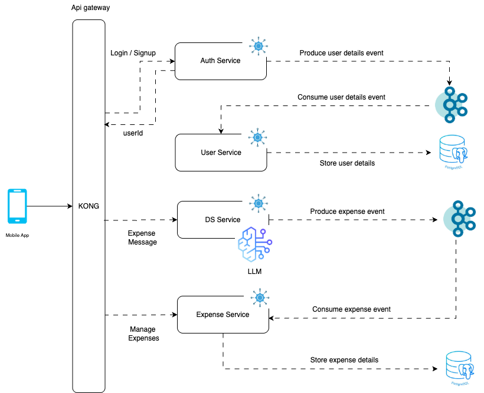

# 💰 Expense Tracker App Backend

This repository serves as the **backend architecture and documentation hub** for the **Expense Tracker App**. It acts as a technical blog that outlines the overall system design, microservice responsibilities, and links to individual repositories.

---

## 🧠 Architecture Diagram

[🛠️ View/Edit Diagram in Draw.io](assets/ExpenseTrackerBackend.drawio)

The system is built using a **microservices architecture**, connected via **Kafka** for asynchronous event-driven communication and managed via **Kong** as the API Gateway.

---

## 🧩 Microservices Overview

### 1. 🔐 Auth Service  
🔗 [Auth Service Repository](https://github.com/varmadeepak/auth-service)

- Handles user signup and authentication using JWT.
- Publishes user registration events to Kafka.
- Acts as the entry point for user identity management.

---

### 2. 👤 User Service  
🔗 [User Service Repository](https://github.com/varmadeepak/user-service)

- Consumes user-related events from the Auth Service.
- Stores and manages user profile data.
- Exposes CRUD APIs for user information (create, retrieve, update, delete).

---

### 3. 🤖 Data Science (DS) Service  
🔗 [Data Science Service Repository](https://github.com/varmadeepak/data-science-service)

- Accepts raw textual inputs describing expenses.
- Uses **Mistral AI LLM** to extract structured details like:
  - Amount
  - Place
  - Expense category
- Publishes structured expense events to Kafka for downstream processing.

---

### 4. 💸 Expense Service  
🔗 [Expense Service Repository](https://github.com/varmadeepak/expense-service)

- Consumes expense events from the DS Service.
- Stores and manages expense records in the database.
- Provides full CRUD APIs for expense data.

---

### 5. 🚪 Kong API Gateway  

- Serves as the unified access point for all services.
- Manages routing, load balancing, rate limiting, and authentication.
- Ensures scalable and secure communication between clients and services.

---

## 📌 Summary

This backend system combines **microservices**, **event-driven architecture**, and **AI-powered automation** to deliver an intelligent expense tracking experience. Users can input natural language descriptions of their expenses, and the system seamlessly processes, categorizes, and stores the data.

> Explore the linked repositories for code, API documentation, and deployment guides.
